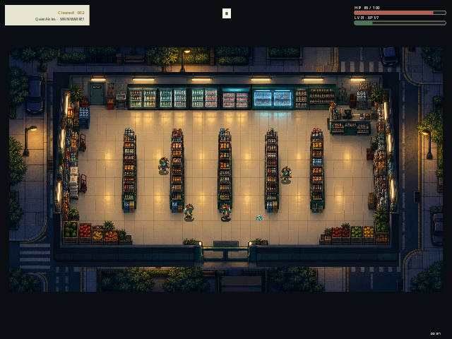

# Supermarket: The Night — PortMaster

**Hold the night shift in a top-down supermarket survival game.** Stock up between waves, keep the aisles clear, and make it to morning.

| | |
|---|---|
| Developer / publisher | dixtuel (Asrın Kılıç) |
| Release date | 30 September 2026 |
| Genre | Action / arcade |
| Store page | [itch.io](https://dixtuel.itch.io/supermarket-the-night) |
| PortMaster target | 64-bit ARM handhelds; 640×480 and higher |

## Screenshot

This 640×480 catalog screenshot shows the game in a PortMaster-style handheld layout. It was captured in an x86_64/Xvfb simulation; it is not evidence of a successful physical R36S test. See the requirements below for the current device verification status.

## Requirements

- A 64-bit ARM (`aarch64`) PortMaster device with a display resolution of 640×480 or higher. 480×320 low-resolution devices are not supported by this package.
- PortMaster's **Godot 4.7.1** and **Westonpack 0.2** shared runtimes. PortMaster may need internet access to install each runtime the first time.
- This package targets ARM handhelds such as the R36S. It is not an x86_64 desktop build. The game and shared runtimes are not bundled in this ZIP.

Physical R36S compatibility has not yet been confirmed. The screenshot is a simulation capture only.

## Controls

| Button | Action |
|---|---|
| Left stick | Move the character |
| D-pad | Navigate menus and choices with focus |
| Right stick | Move the mouse pointer |
| A | Confirm the focused control |
| B | Back or cancel |
| Start | Pause or resume the shift |
| Select | Go back or cancel |
| X | Interact with nearby consoles |
| Y | Restart after a run |
| L1 / R1 | Left-click / right-click at the pointer |
| Select + Start | PortMaster exit shortcut |

The port uses PortMaster's `GPTOKEYB2` mapping, with the legacy helper as a fallback. The left stick maps to WASD, the D-pad navigates menu focus, and the right stick moves the pointer. A sends Enter; B sends Escape. X maps to E for nearby console interaction, Y maps to R to restart after a run, and L1/R1 send mouse clicks. Start pauses and Select goes back. PortMaster's helper handles the firmware-specific Select + Start exit shortcut. Desktop, Android, and touch input paths are unchanged by this port.

## Build

From the repository root, run `scripts/build_portmaster.sh` with Godot 4.7.1 and the required export templates installed. The script imports the project, exports the PortMaster PCK, and creates the PortMaster-ready ZIP. See [`docs/portmaster.md`](../../docs/portmaster.md) for packaging and troubleshooting details.

The package metadata and catalog image are `gameinfo.xml`, `port.json`, and `supermarketthenight/screenshot.png` alongside the launcher and game data.

## Credits and licenses

Created by Asrın Kılıç (`dixtuel`). The game source is MIT licensed. Notices for the game, Godot Engine, and PortMaster gptokeyb / Westonpack projects are included in `supermarketthenight/licenses/`. Godot and Westonpack are installed by PortMaster as shared runtimes and are not included in this port package.
